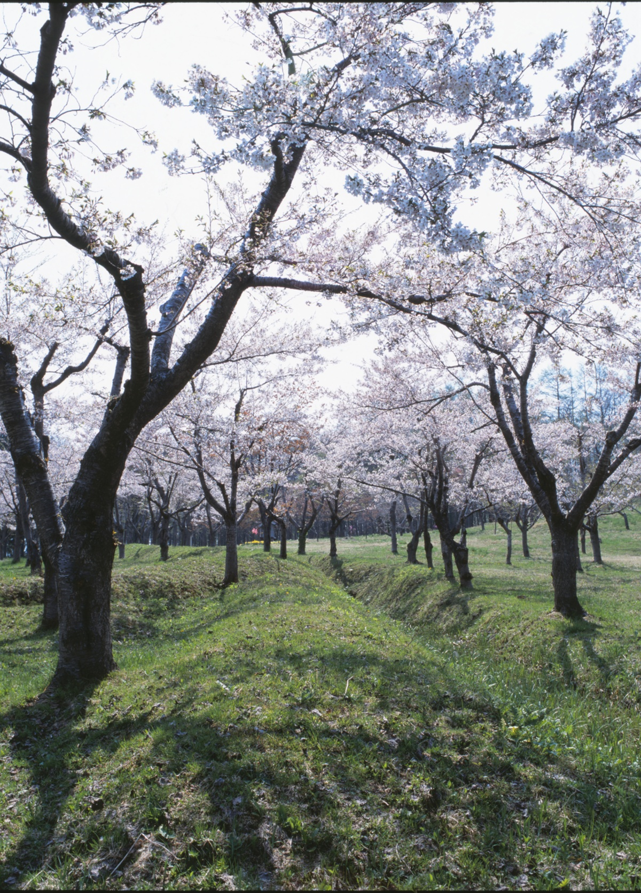
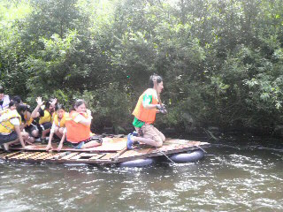

# 欢迎来到厚泽部镇！！

[English](English.html)　Select your language

[中国語](Chinese.html)　选择你的语言

[한국](Korea.html)　　언어 선택

[Deutsch](German.html)　Wähle deine Sprache

[Français](France.html)　choisissez votre langue

[Русский](Russ.html)　Выберите свой язык

[Tiếng Việt](vietnum.html)　chọn ngôn ngữ của bạn

------

## Hinoki Asunaro Forest

生长着日本特有柏树Asunaro的Tsuchihashi自然和教育森林早已禁止采伐，其珍贵的自然环境得到了保护。

任何人都可以安全地走过这片珍贵的森林。

------

## 一座神秘的城堡凭空而建

塔特城堡是在150年前突然建成的。 就在日本作为一个现代国家重生之前，统治北海道的松前氏将他们的城堡从海边的松前搬到了内陆的阿土佐部。 然而，该城堡被榎本武义领导的旧幕府的军队袭击，塔特城堡陷落，今天只剩下护城河、土方和建筑的基石。

------

## 美丽的河流和美味的鱼

流经厚泽镇的山间小溪--厚泽河，在夏季有很多人喜欢钓甜鱼。 你可以享受美丽的河流和美味的鱼。

利用津泽部河的清澈河水进行漂流是一项受欢迎的夏季活动。 从竹筏上跳入冰冷的河水中，同时看着风景一个接一个的变化，这是一种美妙的体验。

