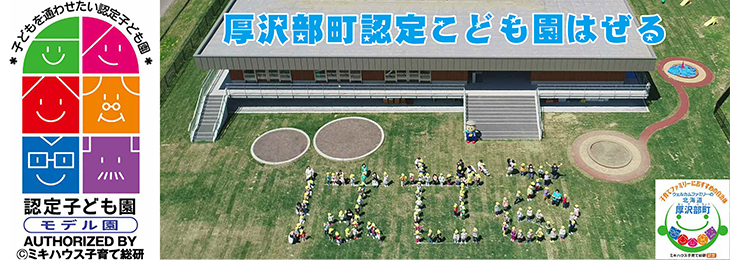

# Bienvenue à Asabu！！

[English](/home/ishii/ドキュメント/01アーカイブ/02プレゼンテーション資料/210830政策コンペ発表/Assabu_HTML_sample/English.html)　Select your language

[中国語](/home/ishii/ドキュメント/01アーカイブ/02プレゼンテーション資料/210830政策コンペ発表/Assabu_HTML_sample/Chinese.html)　选择你的语言

[한국](/home/ishii/ドキュメント/01アーカイブ/02プレゼンテーション資料/210830政策コンペ発表/Assabu_HTML_sample/Korea.html)　　언어 선택

[Deutsch](/home/ishii/ドキュメント/01アーカイブ/02プレゼンテーション資料/210830政策コンペ発表/Assabu_HTML_sample/German.html)　Wähle deine Sprache

[Français](/home/ishii/ドキュメント/01アーカイブ/02プレゼンテーション資料/210830政策コンペ発表/Assabu_HTML_sample/France.html)　choisissez votre langue

[Русский](/home/ishii/ドキュメント/01アーカイブ/02プレゼンテーション資料/210830政策コンペ発表/Assabu_HTML_sample/Russ.html)　Выберите свой язык

[Tiếng Việt](/home/ishii/ドキュメント/01アーカイブ/02プレゼンテーション資料/210830政策コンペ発表/Assabu_HTML_sample/vietnum.html)　chọn ngôn ngữ của bạn

------

## Cyprès japonais Forêt d'Asnaro

La forêt naturelle et éducative de Tsuchihashi, où pousse le cyprès japonais endémique Asunaro, est depuis longtemps fermée à l'exploitation forestière et son précieux environnement naturel a été préservé.

Tout le monde peut se promener en toute sécurité dans cette précieuse forêt.

------

## Un château mystérieux construit dans le bleu.

Le château de Tate a été construit soudainement il y a 150 ans. Juste avant que le Japon ne renaisse en tant que nation moderne, le clan Matsumae, qui régnait sur Hokkaido, a déplacé son château de Matsumae, au bord de la mer, à Atsusawabe, dans les terres. Cependant, le château a été attaqué par les forces de l'ancien shogunat dirigé par Takeyoshi Enomoto, et le château de Tate est tombé. Aujourd'hui, il ne reste que les douves, les remblais et les pierres de fondation des bâtiments.

Traduit avec www.DeepL.com/Translator (version gratuite)

------

## De belles rivières et de délicieux poissons

Le ruisseau de montagne, la rivière Atsusawa, qui traverse la ville d'Atsusawa, est fréquenté par les personnes qui aiment pêcher le poisson doux en été. Vous pouvez profiter de la belle rivière et des délicieux poissons.

Le rafting dans les eaux claires de la rivière Atsusawabe est une activité estivale populaire. C'est une expérience merveilleuse que de sauter du radeau dans la rivière froide tout en regardant les paysages changer les uns après les autres.

