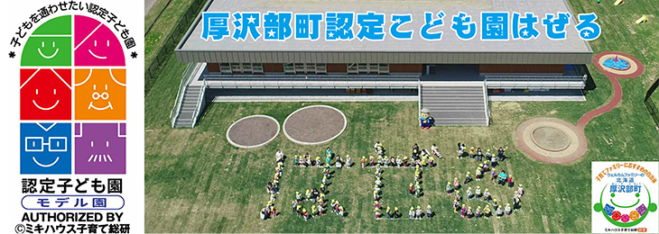

# Willkommen bei Asabu！！

[English](English.html)　Select your language

[中国語](Chinese.html)　选择你的语言

[한국](Korea.html)　　언어 선택

[Deutsch](German.html)　Wähle deine Sprache

[Français](France.html)　choisissez votre langue

[Русский](Russ.html)　Выберите свой язык

[Tiếng Việt](vietnum.html)　chọn ngôn ngữ của bạn

------

## Japanische Zypresse Asnaro Wald

Der Natur- und Lehrwald Tsuchihashi, in dem die endemische japanische Zypresse Asunaro wächst, ist seit langem für den Holzeinschlag gesperrt und seine wertvolle natürliche Umgebung wurde erhalten.

Jeder kann diesen wertvollen Wald sicher durchwandern.

------

## Ein geheimnisvolles Schloss, das aus heiterem Himmel erbaut wurde.

Tate Castle wurde plötzlich vor 150 Jahren gebaut. Kurz vor der Wiedergeburt Japans als moderne Nation verlegte der Matsumae-Clan, der über Hokkaido herrschte, seine Burg von Matsumae am Meer nach Atsusawabe im Landesinneren. Die Burg wurde jedoch von den Truppen des alten Shogunats unter der Führung von Takeyoshi Enomoto angegriffen, woraufhin Tate Castle fiel und heute nur noch der Graben, die Erdwälle und die Grundmauern der Gebäude erhalten sind.

Übersetzt mit www.DeepL.com/Translator (kostenlose Version)

------

## Schöne Flüsse und köstlicher Fisch

Der Gebirgsfluss Atsusawa, der durch die Stadt Atsusawa fließt, wird im Sommer gerne zum Süßfischangeln genutzt. Sie können den schönen Fluss und den köstlichen Fisch genießen.

Rafting auf dem klaren Wasser des Atsusawabe-Flusses ist eine beliebte Sommeraktivität. Es ist ein wunderbares Erlebnis, vom Floß in den kalten Fluss zu springen und dabei zu beobachten, wie sich die Landschaft nach und nach verändert.

