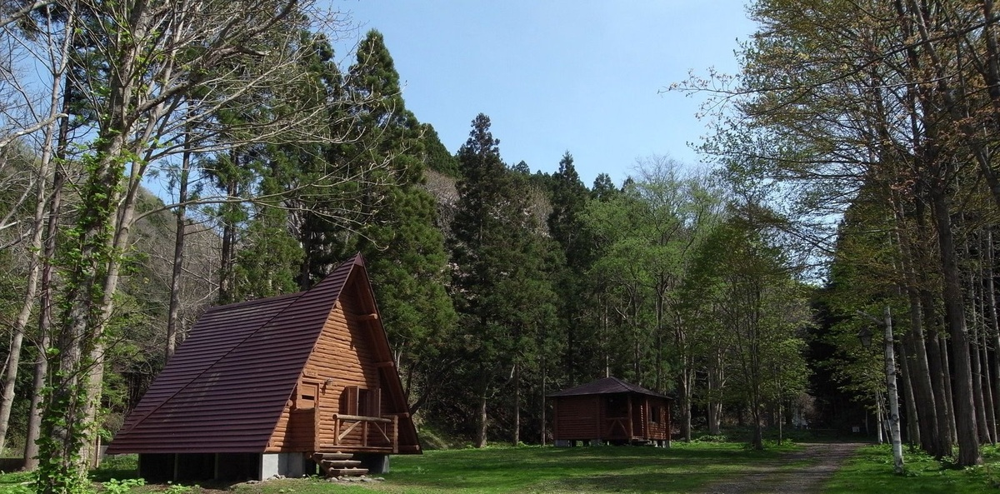

# 厚沢部에 오신 것을 환영합니다！！

[English](/home/ishii/ドキュメント/01アーカイブ/02プレゼンテーション資料/210830政策コンペ発表/Assabu_HTML_sample/English.html)　Select your language

[中国語](/home/ishii/ドキュメント/01アーカイブ/02プレゼンテーション資料/210830政策コンペ発表/Assabu_HTML_sample/Chinese.html)　选择你的语言

[한국](/home/ishii/ドキュメント/01アーカイブ/02プレゼンテーション資料/210830政策コンペ発表/Assabu_HTML_sample/Korea.html)　　언어 선택

[Deutsch](/home/ishii/ドキュメント/01アーカイブ/02プレゼンテーション資料/210830政策コンペ発表/Assabu_HTML_sample/German.html)　Wähle deine Sprache

[Français](/home/ishii/ドキュメント/01アーカイブ/02プレゼンテーション資料/210830政策コンペ発表/Assabu_HTML_sample/France.html)　choisissez votre langue

[Русский](/home/ishii/ドキュメント/01アーカイブ/02プレゼンテーション資料/210830政策コンペ発表/Assabu_HTML_sample/Russ.html)　Выберите свой язык

[Tiếng Việt](/home/ishii/ドキュメント/01アーカイブ/02プレゼンテーション資料/210830政策コンペ発表/Assabu_HTML_sample/vietnum.html)　chọn ngôn ngữ của bạn

------

## 노송 나무 아스나의 숲

일본의 고유종 인 노송 나무 아스나가 생육하는 토교 자연 관찰 교육 숲은 옛날부터 벌채가 금지되어 귀중한 자연 환경이 보존되어 왔습니다.

귀중한 산림 내에서 누구나 안전하게 산책 할 수 있습니다.

------
## 갑자기 만들어진 수수께끼의 성

館城은 지금부터 150 년 전에 갑자기 건설되었습니다. 일본이 근대 국가로 거듭나 직전 홋카이도를 다스리 던 마츠 마에 번은 해안 마츠 내륙의 厚沢部에 성을 옮겼습니다. 그러나 에노모토 다케 아키 이끄는 구 막부군의 공격을 받아 館城은 낙성 지금은 해자 및 토지, 건물의 초석이 남아뿐입니다.

------
## 아름다운 강과 맛있는 생선

厚沢部 마을을 흐르는 계류 厚沢部川은 여름이되면 은어 낚시를 즐기는 사람들이 찾아옵니다. 아름다운 강과 맛있는 생선을 즐길 수 있습니다.

厚沢部川의 청류를 이용한 뗏목 타기는 여름 인기 체험 메뉴입니다. 차례로 바뀌는 경치를 바라 보면서, 화이트에서 차가운 강에 뛰어 드는 것은 멋진 경험입니다.

