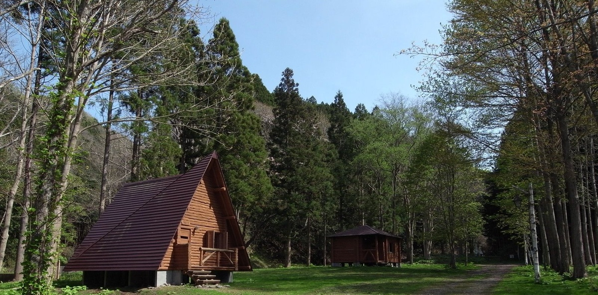
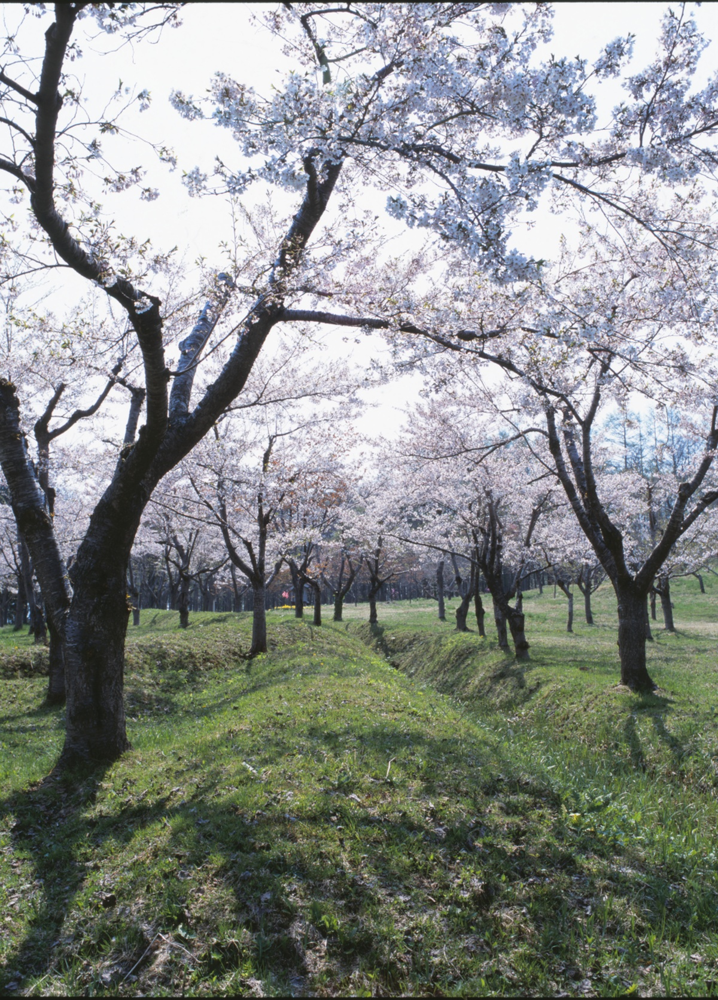
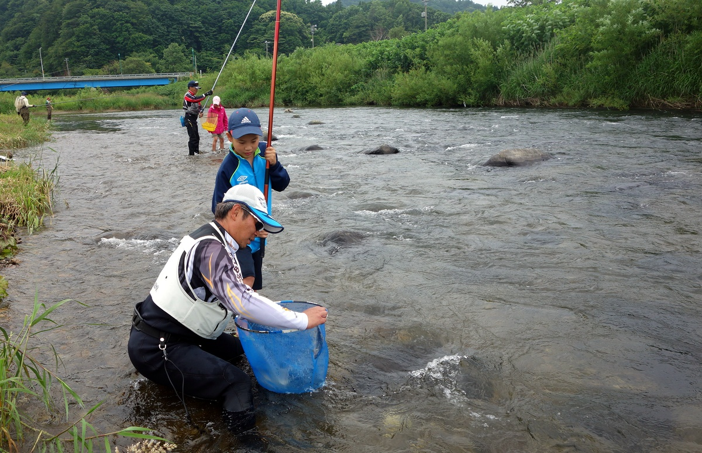
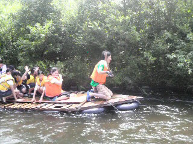

# 厚沢部町へようこそ！！

[English](/home/ishii/ドキュメント/01アーカイブ/02プレゼンテーション資料/210830政策コンペ発表/Assabu_HTML_sample/English.html)　Select your language

[中国語](/home/ishii/ドキュメント/01アーカイブ/02プレゼンテーション資料/210830政策コンペ発表/Assabu_HTML_sample/Chinese.html)　选择你的语言

[한국](/home/ishii/ドキュメント/01アーカイブ/02プレゼンテーション資料/210830政策コンペ発表/Assabu_HTML_sample/Korea.html)　　언어 선택

[Deutsch](/home/ishii/ドキュメント/01アーカイブ/02プレゼンテーション資料/210830政策コンペ発表/Assabu_HTML_sample/German.html)　Wähle deine Sprache

[Français](/home/ishii/ドキュメント/01アーカイブ/02プレゼンテーション資料/210830政策コンペ発表/Assabu_HTML_sample/France.html)　choisissez votre langue

[Русский](/home/ishii/ドキュメント/01アーカイブ/02プレゼンテーション資料/210830政策コンペ発表/Assabu_HTML_sample/Russ.html)　Выберите свой язык

[Tiếng Việt](/home/ishii/ドキュメント/01アーカイブ/02プレゼンテーション資料/210830政策コンペ発表/Assabu_HTML_sample/vietnum.html)　chọn ngôn ngữ của bạn

------

## ヒノキアスナロの森

日本の固有種であるヒノキアスナロが生育する土橋自然観察教育林は、昔から伐採が禁止され、貴重な自然環境が保存されてきました。

貴重な森林内を誰でも安全に散策できます。

------

## 突然つくられた謎のお城

館城は今から150年前に突然建設されました。日本が近代国家に生まれ変わる直前、北海道を治めていた松前藩は、海沿いの松前から内陸の厚沢部にお城を移しました。しかし、榎本武揚率いる旧幕府軍の攻撃を受け、館城は落城し、今は堀や土塁、建物の礎石などが残るだけです。

------

## 美しい川とおいしい魚

厚沢部の町を流れる渓流厚沢部川は、夏になると鮎釣りを楽しむ人々が訪れます。美しい川とおいしい魚が楽しめます。

厚沢部川の清流を利用したイカダ下りは、夏の人気体験メニューです。次々に変わる景色を眺めながら、イカダから冷たい川に飛び込むのは素晴らしい体験になります。

